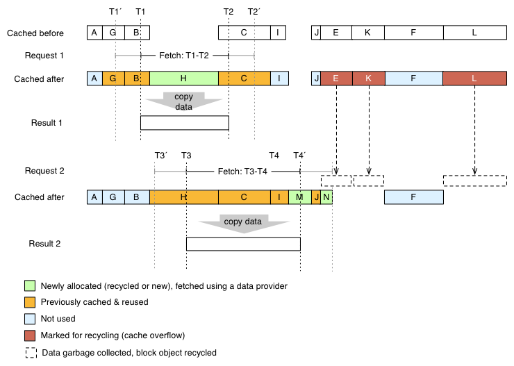

MetOLib: SplitterCache
======================

SplitterCache is used as an asynchronous JS client or server middleware for splitting up big retrieval/calculation tasks into smaller tasks, storing their results in memory cache, and combining the results of the split-up tasks to return the result for the original task. On the following requests for the same service, only the data values not stored in the cached blocks are requested from the data provider.

The SplitterCache was originally implemented for caching timeseries data of meteorological observations and forecasts, using time axis as the task splitting dimension, but any other axis will also do. There is no date/time-specific handling of start, end and resolution task properties, so any numeric values can be used.

**Note**: When using with MetOLib WFS client components to access weather data, the fi.fmi.metoclient.metolib.WfsConnection already uses the SplitterCache internally as a part of the provided WFS client functionality. You may want to use WfsConnection instance as an intermediate API object instead of using this component directly.

Dependencies
------------

SplitterCache requires the following libraries to be available at runtime:

* async.js (<https://github.com/caolan/async>) and
* underscore.js (<http://underscorejs.org/>)

How the caching works
---------------------
This section describes the internal working of the SplitterCache in a couple of scenarios. The images show the cached data blocks before the given operation and after it.

### Empty cache
In this scenario the cache does not contain any data before the fetch operation. 

The original request time span is split into several separately fetched data blocks (three in this case) because the request contained more data points than allowed for one block. The total fetched time series is longer than the originally requested one because of the cache proactively fetches data also at both sides of the request to prepare for executing the future requests faster (see Proactive cache filling). When all blocks have been retrieved the copy of the requested time series between `T1` and `T2` is returned to as a combined data array.

### Some required blocks cached
The cache already contains some of the requested data requested during previous fetch operations. The SplitterCache creates data blocks for the missing parts of the time series and fetches only them from the data provider.

In this case only the block `E` from the newly fetched blocks is actually included in the final response, blocks `D` and `F` are retrieved and stored in the cache as the result of the side fetch.

### All required blocks cached
In a lucky case the cache already contains all the required data blocks including the ones caused by side fetch. In these cases there will be no data requests to the data provider, and combined data array is composed only using the memory cache data.

### Side fetch behind the scenes
Sometimes the side fetch causes requests to the data provider even if all the data for the original request would already be cached.

### Cache overflow & recycling
In this a bit more complicated scenario the cache data size overflows during a fetch operation. This means that the some data blocks are removed from the cache to make space for the new data.

After the first fetch operation the cached data size is noticed to be too large. The least recently used data blocks are marked for recycling
until enough data is removed for the total cached data size to be under the configured maximum again (`E`, `K` and `L` will be removed in this case). These data blocks are actually recycled in the beginning of the next fetch cycle, and their data is let for the garbage collector to be removed from the memory. The recycled data block objects are returned into the empty block pool to be reused during future fetch requests.

SplitterCache API
-----------------

Following API functions are provided by a fi.fmi.metoclient.metolib.SplitterCache instance:

* `addDataProvider(service, providerFunction)`
* `removeDataProvider(service, providerId)`
* `fetch(taskDef, finishedCallback [,progressCallback])`
* `clearCache()`
* `getCachedItemCount()`
* `getFillingDegree()`
* `getHitRatio()`
* `addListener(eventName, callback)`
* `removeListener(eventName, callbackId)`

Implementing DataProviders
--------------------------

The SplitterCache relies on it's data providers to fetch the original (non-cached) blocks of data. One or more data providers may be registered to a SplitterCache instance for each service using `addDataProvider(service,callback)` function. The SplitterCache calls each provider callback registered for the given service in round-robin fashion. This can be used for implementing a simple load balancing between two or more data providers. Each data provider is given a unique id, which is returned from the call to `addDataProvider`. This id is needed to remove the particular data provider later using `removeDataProvider` function.

The data provider callback function receives a copy of the original task definition object given to the `fetch` function. The start, end and the pointCount of the original task definition are changed to reflect the limits of the subtask, otherwise all the properties of the original task definition are delivered to data providers as-is. 

The data provider function is typically given a task definition like this: 

    {
      service: 'service1'
      location: ['location1','location2',...,'locationN'],
      parameter: ['parameter1','parameter2',...,'parameterN'],
      start: time1,
      end: time2,
      resolution: res1,
      pointCount: count12
    }

The location and parameter arrays may be replaced with a single string value, if only one location and/or parameter is requested at the time.

The data provider shall always return a result object of the following structure (regardless of the number of locations and parameters):

    {
      location1: {
        parameter1: [valueArr11],
        parameter2: [valueArr12],
        ....
        parameterN: [valueArr1N]
      },
      location2: {
        parameter1: [valueArr21],
        parameter2: [valueArr22],
        ....
        parameterN: [valueArr2N]
      },
      locationN: {
        parameter1: [valueArrN1],
        parameter2: [valueArrN2],
        ....
        parameterN: [valueArrNN]
      }
    }

Example code (using async):

    var randomProvider = function(taskDef, callback) {
      var retval = {};
      var i = 0;
      async.forEach(taskDef.location, function(loc, locNotify) {
        if (retval[loc] === undefined) retval[loc] = {};
        async.forEach(taskDef.parameter, function(param, paramNotify) {
          if (retval[loc][param] === undefined) retval[loc][param] = [];
          for (i = 0; i < taskDef.pointCount; i++) {
            retval[loc][param].push(Math.random());
          }
          paramNotify();
        }, function(err) {
          // one location completed
          locNotify();
        });
      }, function(err) {
        // all done, simulate network delay:
        setTimeout(function() {
          callback(err, retval);
        }, Math.random() * 100);
      });
    };

    var providerId = cache.addDataProvider('random',randomProvider);

The data provider is responsible for making sure that

* all the locations given in task definition are returned
* all the parameters given in task definition are returned
* the values at the first index of all valueArr arrays reflect the value for the `start` time
* the values at the last index of all valueArr arrays reflect the value for the `end` time
* all valueArr arrays lengths are equal to the `pointCount`

If the data provider does not adhere to these rules, the combining of the final result may not work correctly, or some of the values will be filled with `NaN`.

If not all requested values are available, the data provider should fill the missing values with `NaN` or any other 'missing' value understandable to the using application. If an error occurs during acquiring the data block, and no sensible values can be returned, the data  provider should populate the `err` object with descriptive error information. The SplitterCache will fill the corresponding values of the combined response with `NaN`, and return all the `err` objects as an array for the `fetch` callback function.

Requesting data through cache
-----------------------------

The data requests for SplitterCache are done using `fetch` function. As request parameters the function takes 

* the task definition object, 
* the callback function to return the results when all data blocks have been retrieved and their data combined, and
* the callback function to be called when a single data block has been retrieved (optional)

Example code:

    var cache = new fi.fmi.metoclient.metolib.SplitterCache();
    cache.addDataProvider('obs',obsProvider);
    var taskDef = {
      service: 'obs',
      parameter: 'temp',
      location: 'Rautatientori',
      start: 1367228479,
      resolution: 60*5,
      pointCount: 1000
    };
    cache.fetch(taskDef, function(err,result){
        if (err){
           //handle errors
        }
        //use the result data
      },
      function(err, blockStart, blockEnd){
        //do something with the progress information, show progress bar etc.
      });

Only either of `end` and `pointCount` should be used for each task. If the `pointCount` is given, the returned data arrays will always contains exactly `pointCount` values, and the `end` property is calculated using the `resolution` and the `start` parameters. If only the `end` is given, it's extended until the next even `resolution` multiple starting from `start`, and the `pointCount` is calculated by dividing the adjusted time span by `resolution`.

Cache eviction policy
---------------------

When the maximum configured amount of data items are stored cache is exceeded, the cached values are removed from the cache in following the LRU eviction policy (least recently used first). The eviction is not done in the background, but in the course of the normal `fetch` requests in two phases:

* during each `fetch` call, the amount of data remaining from the last `fetch` is calculated, and if the oldest data blocks are marked for recycling, if necessary.
* During the next `fetch` operation, all the data in the blocks marked for recycling is actually removed from the memory, and the data block itself is recycled to the empty block pool. 

It should be noted that because of the two phases, the cache may temporarily hold more data items at a particular time than the maximum configured amount.

The cache can only store data with one resolution at the time for each service. This is because it needs to combine the data points both from the cached and the newly fetched data blocks. If the resolutions of the data blocks are different the combination is not trivial. Besides the resolution, it's also required that the data points fall exactly on the same time steps. Thus the `start` times of all the cached blocks need to be separated by a multiples of the resolution.
 
 If the resolution of the fetch is different than resolution of the currently cached blocks for a service, or the `start` time does not differ from the cached `start` times by a multiple of the resolution, all the cached data blocks for that service are removed from the cache to protect the merge-ability of the stored blocks of each service. It's thus very beneficial to change the start times of the `fetch` operations only by multiples of resolution, because in this case the previously cached values can be re-used as part of the returned result.

If there is need to keeping the data for the same parameters and locations in the cache with two different resolutions, one can use two different services for them. In this case the possible duplicate time step values are also duplicated in the cache memory.

Proactive cache filling (side fetch)
------------------------------------
 
By default the SplitterCache tries to fetch more values to the cache than the ones included in the original request to anticipate future data fetching needs. This is effect is called side fetching, and it can be controlled by configuration parameters `sideFetchBeforeFactor` and `sideFetchAfterFactor`. The default values are 0.5 and 1 respectively. This means that the cache will try to fetch 1 * `pointCount` of extra values before `start`, and `0.5 * pointCount` of extra values after the `end`. Only values between the `start` and the `end` for any particular request will be returned as the combined results of the `fetch` operation however.

Side fetch can be disabled by setting the property value `sideFecthBeforeFactor` and/or `sideFetchAfterFactor` to value 0;

Automatic defragmentation
-------------------------

The SplitterCache automatically tries to merge small continuous data blocks to avoid cache fragmentation. The defragmentation detection is done during every fetch cycle for previously fetched data blocks. If there are continuously positioned (by time) data blocks for the same service, locations and parameters, and either of them contains less than `minBlockDataPoints` time steps, these blocks are merged into a new blocks covering the data of both blocks. The merge is only done if the combined size would still be under `maxBlockDataPoints`. All the merged blocks created during a fetch cycle are added to the available cache blocks in the beginning of the next fetch cycle. It's done in next cycle because merging may take some (if not much) time, and the waiting for it before letting the fetch operation commence would delay things unnecessarily. The old merged blocks are marked for recycling, and will be recycled in the next fetch cycle.

The defragmentation can be disabled by setting the property `minBlockDataPoints` to value 0;

Cache configuration
-------------------

The following configuration properties can be given with the SplitterCache constructor:

    var cache = new fi.fmi.metoclient.metolib.SplitterCache({
      sideFetchBeforeFactor: 0.5,
      sideFetchAfterFactor: 1,
      minBlockDataPoints: 20,
      maxBlockDataPoints: 500,
      maxCacheDataSize: 50000
    });
 
Note: `maxCacheDataSize` is measured in approximate data size: A data block with 2 locations, 5 parameters and 10 time steps is calculated as 2 * 5 * 10 = 100 units. `minBlockDataPoints` and `maxBlockDataPoints` are calculated as time steps.

Introspecting internal cache events
-----------------------------------

Listeners can be added to be notified on the following cache events using `addListener(eventName,callbackFunction)`

The following event names are recognized:
  
**blockCreated**, callback receives a DataBlock instance  
Happens when a new instance of data block is created. The created data blocks are automatically recycled to be reused by the following requests after eviction to reduce garbage collection.

**blockPrepared**, callback receives a DataBlock instance  
is called when a (new or recycled) data block gets its new (sub)task definition.

**blockProviderFetchStarted** and **blockProviderFetchFinished**, callback receives a DataBlock instance  
are called before and after the cache retrieves the data for the block from a data provider.

**blockCacheFetchStarted** and **blockCacheFetchFinished**, callback receives a DataBlock instance  
are called before and after the cache retrieves the data for the block from it's internal cache.

**blockPinned** and **blockUnpinned**, callback receives a DataBlock instance  
blockPinned happens when a data block is temporarily prevented from eviction during the `fetch` and `merge` operations. The blockUnpinned happens when this lock is released.

**blockEvicted**, callback receives a DataBlock instance
means that the block's data has been marked for later deletion from cache.

**blockRecycled**, callback receives a DataBlock instance
happens after the block's data has been deleted from the memory and given to the GC (if no other references to it exist). The block itself is returned to the recycled block pool.

**blockAged**, callback receives a DataBlock instance
happens for each data block stored in the cache, but not used for the current fetch() operation. When it is used, the age is zeroed. The higher the block's age is the more likely it's being evicted.

**blockMarkedForMerge**, callback receives a DataBlock instance
happens when a data block is selected for merging with another, temporarily continuous data block (see Automatic defragmentation). This event is always followed by `blockEvicted` after the merge is complete, and eventually `blockRecycled` for the same block.

**fetchStarted** and **fetchFinished**, callback receives a copy of the taskDefinition  
are called once before and after each fetch() operation.

**evictStarted**, callback receives the following object:

    {
      inCache: <amount of data items stored in cache>
      toEvict: <amount of data items to be removed>
    }

called just before the data eviction is started (data blocks marked for later recycling).

**evictFinished**, callback receives the following object:

    {
      inCache: <amount of data items stored in cache>
      evicted: <amount of data items removed during eviction>
    }

called just after the data eviction is finished (data blocks marked for later recycling).

**cacheCleared**, callback receives the name of the service, the results of which were removed.

**dataProviderAdded** and **dataProviderRemoved**, callback receives the following object:

    {
      service: <name of the service>
      providerId: <internal ID of the added/removed provider>
    }

Original author: Ilkka Rinne / Spatineo Inc. for Finnish Meteorological Institute
